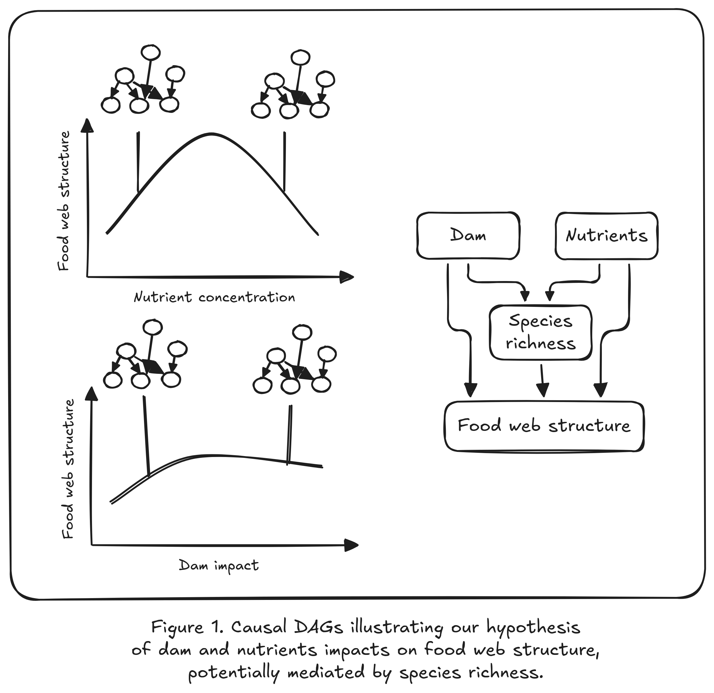
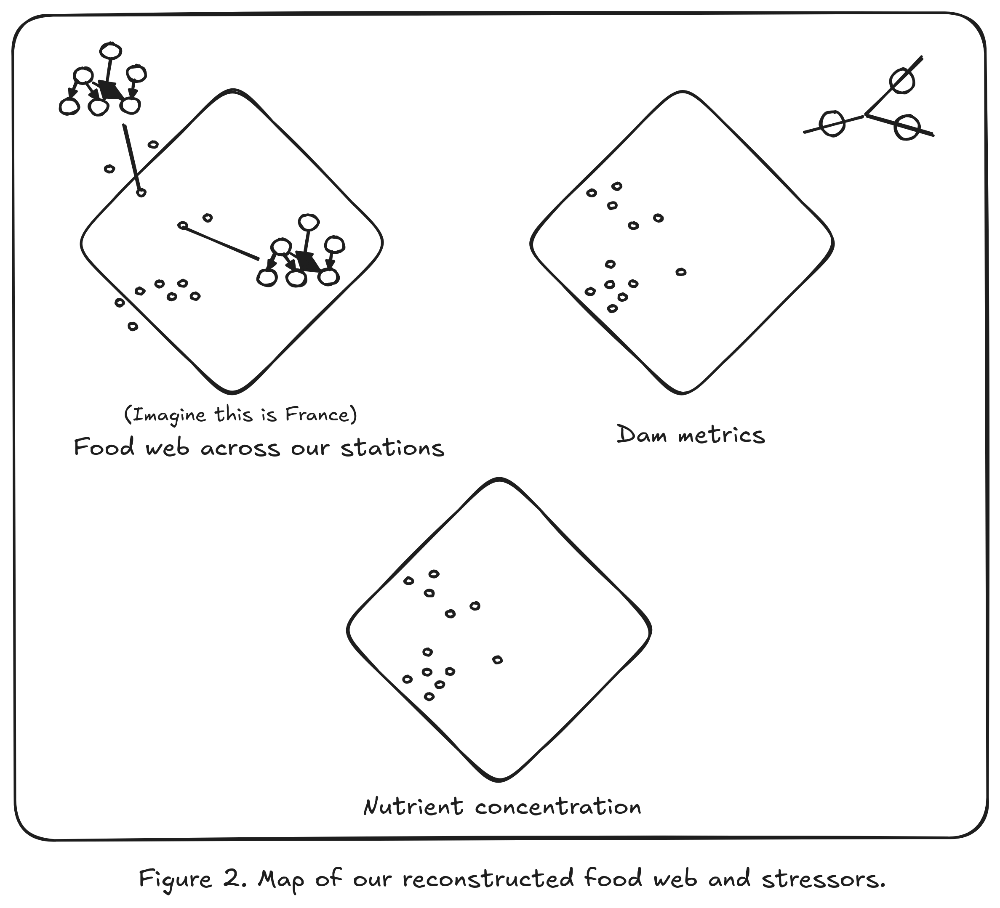
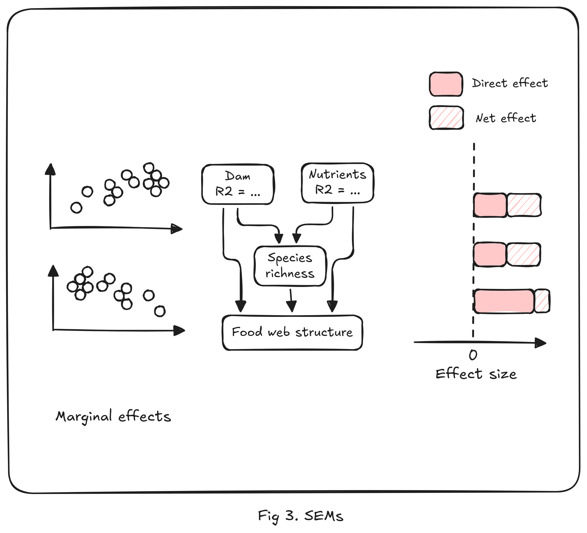

```{r}
#| output: false
#| echo: false
library(renv)
renv::load()
renv::status()

library(here)
library(DiagrammeR)
library(targets)
tar_config_set(
  store = here::here("_targets")
)
```

## Abstract

Anthropic disturbances and ecosystem processes transcend the artificial
boundaries between land, freshwater, and sea. While these systems are
interconnected through species and material fluxes, they are often studied in
isolation. In response, the concept of metaecosystem has emerged as a powerful
framework to understand how fluxes among ecosystems shape their functions and
dynamics. Disrupting these fluxes can have dramatic consequences that ripple
across entire landscapes. In aquatic systems, dams and nutrient pollution are
known to strongly affect fish communities. Yet, little is still known about how
these effects propagate and potentially accumulate, through hydrographic basins
and ultimately to the sea. Using bayesian spatio-temporal statistical models
(R-INLA), we aim to analyse existing data on food-web structure across France,
combined with environmental variables (dams, nutrients, …), to quantify how
breaking or increasing fluxes among systems disturbs food-web structure locally
and how these disturbances spread throughout the metaecosystem.

**Keywords:**
*foodweb ecology,
stream network,
spatial autocorrelation,
bayesian statistics.*


## Introduction

While patterns in community change within river network have been well studied,
these studies have mostly focus on specise richness [@Bonnaffé-etal-2024b], or
roughly defined functional composition [@Vannote-etal-1980].

- @Barnes-etal-2026 food web complexity mediates diversity-functioning
relationship. Interesting metric of trophic complementarity, could be used for
our study if we can formulate clear hypothesis of stressors on that metric.

- @Lindgren-Rue-2015 R-INLA paper

### River-estuary-sea continuum

- @Xenopoulos-etal-2017 highlights the importance of accounting for the full
gradient from headwater to the sea. Freshwater and coastal ecosystems are
connected by flux of carbone and nutrients (N, P), as well as, movement of
migratory species. Reviews work connecting river and sea, that said, most of
them focus on chemical fluxes, remain relatively local, and none of them focused
on the food web structure.

- Catchment land-use impacts macro-invertebrates along the river-sea continuum
with no dilution effect [@Bierschenk-Savage-Matthaei-2017].

- The Land-to-Ocean Continuum (LOAC) concept has been used to study carbon
fluxes between land and ocean, and how these fluxes, and feedback loop influence
the carbon storage by oceans [@Regnier-etal-2022].

- @Hong-Chen-Wang-2015 Editorial overview of studies investigating the impact
of human pressure along the river-estuary-sea continuum, more focused toward
biochemistry than ecology.

- @Ouellet-etal-2022 provides a conceptual model (DWOC) to advance a more
holistic management of diadromous species across the watersheds-ocean continuum.

- @Tee-etal-2021 studies the river-to-sea continuum of microbial communities
through community composition and their function (nutrient cycling).

- @Whitfield-etal-2024 reviews how species richness changes along the salinity
gradient in estuaries. As we go to freshwater to brackish water we loose species
richness, and as we to brackish water to the sea we recover species richness.

- @Elliott-Quintino-2007 argues that it is difficult to detect the effect of
anthropogenic pressure in estuary as estuaries are already stressed environment.
In particular, this means thinking about the indicators used to describe
ecosystem states (diversity, and functionning).

- @Little-Wood-Elliott-2017 @Lechêne-etal-2018 @Olli-etal-2019 and
@Freitas-Araújo-2025 study how communities change along environmental gradient
in estuaries.

- @Attrill-2002 critiques Remane diagram and proposes and quantitive, testable
alternative that consider salinity ranges instead of salinity.

- @Macedo-etal-2021 Food webs are simpler during the dry season than the rainy season
in the estuarine and neritic zones. During the rainy season, the food web of the
neritic is largely shaped by migratory species from the estuarine and oceanic
areas.

- @Álvarez-Romero-etal-2015 proposes an integrated framework to include land-use
change in cactchement in the impact on coastal biodiversity.

- @Truchy-etal-2026 links metaecosystem and ecosystem services theories to
develop an unified framework for managing sociohydroecosystems.

- @Potter-etal-2015 review and categorize the different ways fish use estuaries.

### Freshwater ecosystems

- The River Continuum Concept has shaped the freshwater ecology researsh by
links physical gradients along rivers to predictable changes in community
structure, energy sources, and ecosystem functioning
[@Vannote-etal-1980; @Doretto-Piano-Larson-2020].

- Serial Discontinuity Concept is a framework to predict the impact of
discontinuities, such as dams, on biotic and abiotic variables along the river
continuum [@Ward-Stanford-1995].

- The Flood Pulse Concept (FPC) complements the RCC as it focuses on the lateral
dimension of rivers and its role in explaining community productivity, while the
RCC focused on the longitudinal aspect. The FPC states that its the rythm of
flood and recession -- that is, the pulse -- which structures ecosystem
productivity, not the flow [@Junk-Bayley-Sparks-1989].
  - Terrestrial organic matter (leaf litter, vegetation, soil nutrients) gets
  dissolved and mobilized into the water
  - Aquatic plants and algae explode in productivity in the shallow, sunlit
  floodwaters
  - Fish and invertebrates move onto the floodplain to feed and reproduce
  - When waters recede, nutrients and organic matter flush back into the main
  channel

- The River Wave concept as unifying framework of different concepts of
freshwater ecology [@Humphries-Keckeis-Finlayson-2014].

- Community richness and hence food web structure is expected to be driven by
nutrient availability [@Ho-Altermatt-Carraro-2023].

- @Carraro-Ho-2025 link river shapes community diversity and food web structure
using a numerical approach. Higher spatial heterogeneity and lower biomass in
elongated rivers than compact ones, driven by higher variability in nutrient
input load.

- @Harris-etal-2026b mobile consumers (fish, birds) use heterogeneous resources
in braided river, New Zealand.

- @Garcia-etal-2025 invasive make trophic structure more stable in lake fish
communities (France)

### Multiple stressors

- Synergistic and antagonistic effects of multiple stressors
[@Jackson-Pawar-Woodward-2021a; @Orr-etal-2024a].

- Temperature can interact with nutrients and impact food web structure in a 
nonlinear way [@Bonnaffé-etal-2024b, @Binzer-etal-2012].

- [@Danet-etal-2021b; @Bonnaffé-etal-2024b].

- @Zhang-etal-2026a precipitation modulates human impacts on riverine food webs

### Connectivity

- Small dispersal stabilizes through spatial structure and asynchrony
[@LeCraw-Kratina-Srivastava-2014; @McCann-Rasmussen-Umbanhowar-2005;
@Pillai-Gonzalez-Loreau-2011].

- A metaecosystem model shows that dispersal of living organisms (that consume 
nutrients) is stabilising,while dispersal of non-living compartments such as 
nutrients or detritus is destabilising [@Gounand-etal-2014].

- Prey switching of mobile top predators can stabilize connected food webs
through ‘spatial coupling’
[@LeCraw-Kratina-Srivastava-2014; @McCann-Rasmussen-Umbanhowar-2005;
@Pillai-Gonzalez-Loreau-2011].

- At high dispersal/connectivity the stabilizing effect wanes as strongly 
connected patches behave as a single patch
[@LeCraw-Kratina-Srivastava-2014; @McCann-Rasmussen-Umbanhowar-2005].

- Studies between pairs of the following connectivity, complexity and stability
are common. However, studies investigating how these are interconnected are
rare [@LeCraw-Kratina-Srivastava-2014].

- Connectivity has 4 dimensions: longitudinal, lateral, vertical and temporal
[@Grill-etal-2019].

- We identified five pressure factors to represent the main human
interferences within the four dimensions of fluvial or river connectivity 
[@Grill-etal-2019]:
  (1) river fragmentation (longitudinal);
  (2) flow regulation (lateral and temporal);
  (3) sediment trapping (longitudinal, lateral and vertical);
  (4) water consumption (lateral, vertical and temporal);
  (5) infrastructure development in riparian areas and floodplains
(lateral and longitudinal).

- In freshwater system, fish dispersal is limited. A meta-analysis found that
the mean dispersal kernel is around 10km [@Comte-Olden-2018].

- Neutral metacommunity model explains biodiversity pattern in the Mississipi
river, showing the key role of dispersal in explaining community structure along
the river continuum [@Muneepeerakul-etal-2008].

- Connectivity structures and mititgates effect of drying events in
macroinvertebrates communities [@Chalmandrier-etal-2025b].

- It is key to adopt a network perspective to understand how diversity is
created and maintained within riverine ecosystems [@Altermatt-2013b]. With this
perspective one can account for the dendritic network and so the spatial
processes that shape diversity.

- From points [@Death-Winterbourn-1995]... to lines (RCC, SDC)... to dendritic
networks [@Shepherd-Ellis-1997].

- River network characteristics, local network properties and their
interaction were important individual contributors to explaining local
species richness of aquatic insects [@Altermatt-Seymour-Martinez-2013].
Effect of connectivity on richness supported experimentally 
[@Carrara-etal-2012].

- @Altermatt-Fronhofer-2018 in exprimental microcosms population densities are
found to be more heterogeneous in dendritic than linear networks.

- @CampbellGrant-Lowe-Fagan-2007 the geometry of dendritic network interacts
with species movement and reshape population densities and interaction network.

- @Giacomuzzo-etal-2026 shows that impact of disturbances is modulated by the
combination of ecosystem size and connectivity with experimental miscrocosms.

### Decomposing spatio-temporal patterns

- @Frelat-etal-2022 decompose change in food web structure and species
composition across space and time using a tensor decomposition. We could
probably try the method for our work.

- @Kortsch-etal-2021 investigates change in food web in the Baltic Sea using
weighted and unweighted structural metrics.

### Dams

- Decrease river connectivity / reduce migration [@Dean-etal-2023b;
@He-etal-2024; @Pedersen-etal-2012].

- Reservoir, lotic from lentic conditions, can result in hypoxic conditions.
Favor phytoplancktons and macrophytes [@Ding-etal-2026; @Dean-etal-2023b].
Facilitate the spread of invasive species [@Johnson-Olden-VanderZanden-2008b].

- Reservoir increase residence time of nutrients upstream and decrease the
downstream output, which can result in a decrease in primary productivity.

- Hydropeaking - that is, the sudden release of large water to answer the
higher electric demand  - can harm riverine community due to sudden change
in water level and water flow.

- Cumulative impact of dams can reduce the nutrient input in deltas
[@Dean-etal-2023b].

- A review [@Ellis-Jones-2013b] suggests that two recovery gradients exist in
regulated river:
  1) a longer, thermal gradient of around 100 km;
  2) a shorter resource subsidy gradient of around 1-4 km.

- @Zhu-etal-2024 shows that dam areas show lowest richness and highest
connectance, while areas with dam removed show highest richness but lowest
connectance.

- @Dolan-etal-2026 Meta-analysis shows that native and non-native species
increased after barrier removal, but the positive effect was strongest for
native species

- @Chan-etal-2025b dam have negative impact on diadromous fish species. The
installation of fish passes didn't have a positive effect. Dam removal had a
positive effect.

- @VanLooy-Tormos-Souchon-2014 Dam impacts on fish communities is dominated by
local rather regional effects in the Loire basin.

### Nutrients

- @Mwanake-etal-2026 DOC-to-nutrient ratios in river decline worldwide

- @Ma-etal-2026 finds that human impact destabilize riverine fish communities,
but habitat complexity buffers this destabilizing effect.

### Meta-ecosystems

- @Loreau-Mouquet-Holt-2003a fundational paper that defines the concept of
meta-ecosystem.

- @Polis-Anderson-Holt-1997 founding synthesis of how spatial subsidy, flux of
consumer and resources reorganise food webs.

- @Nakano-Murakami-2001 shows the seasonal coupling between a forest and
stream, where subidies flux alternate between season. Flux from aquatic to
terrestrial peaked in spring, while the reciprocal flux peaked in summer.

- @Leibold-etal-2004b provides a definition for the concept of meta-community
and present different paradigms: patch dynamic, species sorting, mass effect and
neutral perspective. See also @Loreau-Holt-null-2004.

- @Duffy-etal-2007 reviews of study incorporating trophic complexity in BEF
literature.

- @Spaak-etal-2026 provide a metric of coupling between ecosystems based on the
Jacobian.

- @Peller-etal-2026 Nested flows of nutrients and consumers stabilize
metaecosystems through cross-scale source-sink dynamics.

- @Govaert-Colombo-Altermatt-2026 disturbance responses can be modified by local
  resource availability and cross-ecosystem flows.

### Traits

::: {.callout-note}
This section may not be relevant for the current manuscript. It may however be
useful resource for future extension of the project that may include trait
space analysis.
:::

- @Brosse-etal-2021 FISHMORPH database which contains 10 morphological traits
for around 50% of freshwater fish species worldwide.

- @Su-etal-2023 in North American freshwater, invasive species are often highly
fecund, long-lived and large. Invaded community on the other hand exhibit a
high functional distance between the species it comprises leaving empty
functional space for potential invaders.

- @Toussaint-etal-2018 Non-native species led to marked shifts in functional
diversity of the world freshwater fish faunas

## Hypotheses

Building on the causal structure below (Fig. 1) and the literature reviewed
above, we formulate four hypotheses.



We focus on three structural metrics with well-developed theoretical
expectations: **connectance**, **mean trophic level**, and a **trophic
complementarity** metric following @Barnes-etal-2026. Because connectance, and
potentially other structural metric, are mechanically linked to species
richness [@Cohen-Briand-1984; @Martinez-1992] we will incorporate richness as
mediator variable to separate direct and richness-mediated effects .

### H1: Nutrients have a unimodal effect on food web structure

We expect an overall humped relationship between nutrient availability (proxy
of productivity) and food web structure [@Mittelbach-etal-2001]. Moderate
nutrient enrichment should increase local productivity and prey availability,
supporting more diverse and complex food webs [@Ho-Altermatt-Carraro-2023; but
see @Post-2002]. Beyond a threshold, excess nutrients are expected to degrade
food web structure through hypoxia, algal dominance, and turbidity
[@Ding-etal-2026; @Dean-etal-2023b], or through the destabilization of higher
trophic level as predicted by the *paradox of enrichment* [@Rosenzweig-1971].
This is consistent with @Bonnaffé-etal-2024's recent finding that temperature
and nutrient interact magnifying food web simplification. In sum, we expect
mean trophic level and trophic complementarity to rise then fall with nutrient
concentration, and connectance to follow the opposite pattern (mostly through
richness-mediated effect).

### H2: Dams fragment the lanscape but homogeneize biotic community

We distinguish a *local* pathway (distance to nearest dam) from a *global*
pathway (cumulative barrier effect / basin-wide fragmentation). At the (global)
basin scale, cumulative (linear) downstream fragmentation is expected to reduce
species richness, mean trophic level and trophic complementarity, through loss
of migratory and piscivorous species that depend on longitudinal connectivity
[@Dean-etal-2023b; @He-etal-2024]. On the other hand, the upstream cumultative
fragmentation homogeneize hydrological conditions resulting in more similar
biotic community [@Poff-etal-2007]. As a result, cumulative (dendritic)
upstream fragmentation is expected to reduce trophic complementarity and
increase connectance through the promotion of generalist -- sometimes invasive
-- species [@Johnson-Olden-VanderZanden-2008b; @Encina-etal-2024;
@Bylak-etal-2023]. At a local scale, this phenomenon is expected to increase
near reservoir and so should be come stronger as the distance to the nearest
downstream dam decreases. Conversely, we expect the opposite effect of the
distance to the nearest upstream dam because of the negative effect of sediment
starvation and hydropeaking on productivity [@Ellis-Jones-2013b].

### H3: The effect of dams and nutrients on food web structure is partly mediated by species richness

Dams and nutrients can impact species richness (as described above), which in
turn impacts food web structure. This is an indirect pathway through which
stressors can reshape food web. In addition, we predict candidate direct-effect
mechanisms to operate. In particular, the impact of invasive species (described
in H2) operates both indirectly and directly on food web structure. Indirectly
through the potential exclusion of native species, directly through its unique
generalist diet. We note, as a limitation, that the mediated effect from
richness to food web structure may also capture the impact of other confounding
factors acting on species richness and food web structure independently of
stressors (such as habitat complexity).


### H4: Stressor impacts change along the river-estuary-sea continuum, and peak in estuaries

We predict that stressor impacts (nutrient and dams) on food web structure —
i.e. an interaction between continuum position and stressor magnitude — is not
uniform along the continuum. Specifically, because estuaries are naturally
stressful environments (fluctuating salinity, turbidity, low baseline
diversity), resident communities may already sit closer to their tolerance
limits and hence be more sensitive to added anthropogenic pressure
[@Elliott-Quintino-2007].

### H5: Nutrient impact on food web structure is magnified in lentic, dam-impounded reaches

We predict a true stressor-by-stressor interaction: the effect of nutrient
concentration on food web structure (H1) is amplified in sites closer to
downstream dam because of longer residence time. Impoundment slows water
transit, giving phytoplankton more time to take up available nutrients and
convert them into biomass rather than being flushed downstream
[@Chen-etal-2020]. We therefore expect the nutrient effect on species richness,
connectance, mean trophic level and trophic complementarity to strengthen as
distance to the nearest downstream dam decreases, i.e. a nutrient ×
local-downstream-dam interaction. This tests for a synergestic interaction
between nutrient and dam impacts [@Jackson-Pawar-Woodward-2021a;
@Orr-etal-2024a].

## Statistical model

We formalise H1–H5 as two linked Bayesian spatial models fit in INLA, following
the mediation structure introduced in H3. Structural metrics (connectance, mean
trophic level, trophic complementarity) are fit as separate response models
sharing the same covariate structure. Site-level covariates are: `nutrient`
(nutrient concentration or composite index, H1); `dam_down_local` and
`dam_down_global` (distance to nearest downstream dam, and cumulative
downstream fragmentation, H2); `dam_up_local` and `dam_up_global` (distance to
nearest upstream dam, and cumulative upstream fragmentation, H2); `richness`
(local species richness, H3); and `habitat` (categorical variable
distinguishing *river*, *estuary* and *sea* sites). `S(site)` denotes the
spatial random effect.


::: {.callout-note}

`S(site)` can be a Whittle–Matérn field on the river [metric
graph](https://davidbolin.github.io/MetricGraph/articles/MetricGraph.html)
[@Bolin-Simas-Wallin-2023] for river sites, and a standard 2D SPDE field for
coastal sites (if needed, maybe a metric graph will be sufficient if sites are
close enough to the river mouth).

:::

::: {.callout-note}

We use a categorical variable to caracterise site position along the continuum
to avoid identifiability issue. As a continuous variable (e.g. distance to
river mouth) may already be captured by the spatial random effect, making the
model unable to disentangle the two.

:::

```
structure ~ nutrient + nutrient^2 # H1
            + dam_down_local + dam_down_global # H2
            + dam_up_local + dam_up_global # H2
            + nutrient:dam_down_local # H5
            + habitat:nutrient # H4
            + habitat:dam # H4
            + richness # H3
            + S(site) # Handle spatial auto-correlation

# H3 - Model richness as a mediator variable
richness ~ nutrient + nutrient^2
           + dam_down_local + dam_down_global
           + dam_up_local + dam_up_global
           + nutrient:dam_down_local
           + habitat:nutrient
           + habitat:dam
           + S(site)
```

::: {.callout-note}

The `structure` and `richness` equations above are not a single joint model.
Instead, we fit the two models separately. For H3's mediated pathway, we draw
matched posterior samples of the relevant stressor coefficient from the
`richness` fit and the `richness` coefficient from the `structure` fit,  and
multiply them to obtain a posterior distribution for the indirect effect. The
direct effect is read directly from the `structure` model's stressor
coefficient, and the total effect is the sum of the two. This approach is
common practice in Bayesian mediation, but it is important to note that it does
not fully propagate joint uncertainty.

:::

## Methods

### Food web inference

To infer local food web structure, we used a metaweb approach. 
That is, we build a web compiling the potential feeding interactions between 
all species of the dataset. Importantly, our metaweb takes into account 
intra-specific variation in species diet. We did so by defining trophic 
interactions at different life stages for each species.

#### Metaweb nodes

The nodes of our metaweb represent a species at a given lifestage. Specifically,
fish species were divided into nine body class sizes evenly distributed. Each
body size class within a given species is what we call a ‘trophic species’
assuming that conspecifics of the same body size class share similar trophic
interactions because trophic interactions are largely determined by
predator–prey body size ratio in freshwater ecosystems
[@Brose-Williams-Martinez-2006].

In addition of fish species, seven basal nodes (resources) were added at the
base of the metaweb: detritus, biofilm, phytoplanckton, zooplanckton,
macrophytes and zoobenthos.
We represent the basal food web structure in the Appendix.
<!-- TODO: restore "(see @sfig-foodweb-base)." once the food web figure is re-added below. -->
We assumed that these resources were present at all sampling sites.

#### Infer missing fish lengths

Most length of fishes are measured but not all.
Yet, we need individual fish length to determine their diet based on their 
ontogeny.
We infer missing fish size using information on the given fishing operation.
When there are more than three observations of the fish species, we use a
truncated normal distribution (package truncdist; @Nadarajah-Kotz-2006).
The mean and variance are given by the modes of the observed distribution of the
fishing operation.
The minimum and maximum of the distribution are given by the minimal and maximal
length observed on the entire data set for that species.
We do so to avoid infering irrealistic lengths.

#### Get fish diet

We use fishbase as a primary source to extract fish diet at their different
life stages, to get on which basal categories species feed on and whether they
are piscivorous or not.
We detail in the Supporting Information how made the correspondance between our
categories and the one of fishbase.
We remove species that have an occurence lower than
`r tar_read(params)$occurence_min` in the entire dataset which comprise
`r tar_read(n_rare)` species.
This enable to avoid retrieving diet information of species that will have a
minimal impact on food web structure due to their rarity.
We add a larvae stage when missing, assuming that fish larvae feed on
zooplankton [@Dabrowski-1984b].
We assume that fish individuals are larvae if they measure less than 2 cm.
To classify individuals as juvenile or adult we use the length at maturity of
the species as a threshold.
When this information was not available we used a single stage (*combined*) by
merging the diets of the two stages.
We did not consider a recruit stage.

#### The metaweb

Predation window are assumed to be 0.03 to 0.45 of individual body size for
piscivorous species.
We then use the package [foodwebbuilder](https://github.com/Fellows-of-the-Fish-Food-Webs-F3W/foodwebbuilder)
to build the metaweb and the local food webs through subsampling.
We investigated the effect of the number of size classes on the structure of the
reconstructed metaweb.
We observed little influence of the number of size classes on the metaweb
connectance @sfig-metaweb-sizeclass.
So, we decided to split each species 5 size classes as in @Bonnaffé-etal-2024b.

::: {.callout-note}
The choice of a constant predation window has an important implication.
It implies that what only matters in terms of ecosystem functioning is the
individual size (once the species is known to be piscivorous).
In this setting, two piscivorous individual of different species but same size
will eat the very same things.
:::

#### Subsampling the metaweb to get local food webs

## Results






## Discussion

### Limitations

Regarding food web structure, we have simplified the base of the web and exclude
macro-invertebrates.
This choice naturally emphasizes the functional role of fishes in shaping food
web structures.
Yet, it would be valuable to include macro-invertebrates within the food web to
get a more exhaustive picture of how aquatic community respond to stressors
along the riversea continuum.

# Supporting Information

<!-- TODO: re-add "Structure of the food web base" (#sfig-foodweb-base) and
"Venn diagramm" (#sfig-venn) sections once the image path bug for figures
inside custom crossref float divs is fixed (dynamic `../`-relative paths
computed via to_rel()/tar_read() lose their slash when rendered inside
`::: {#sfig-...}` divs, e.g. "../figures/foodweb.png" becomes
"..figures/foodweb.png"). -->

## Model DAG

Put model DAG here using targets.

## Number of size classes and metaweb structure

::: {#sfig-metaweb-sizeclass}

How metaweb connectance varies with the number of size classes.

:::
