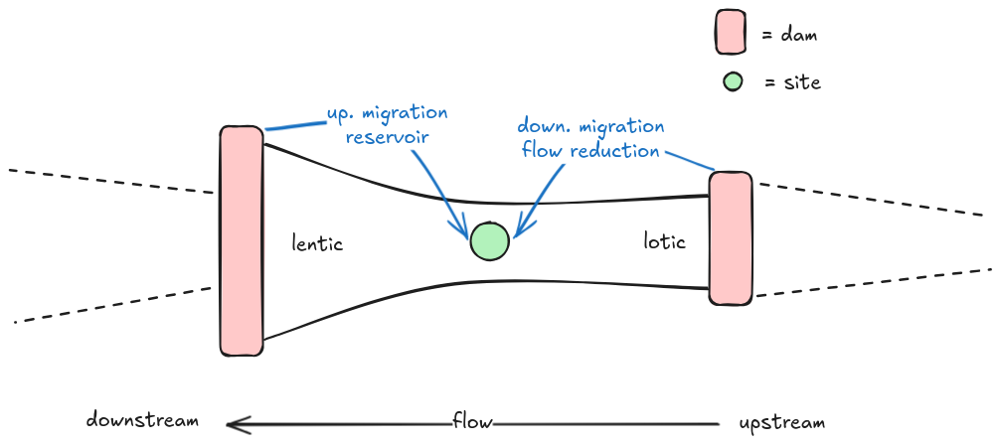

```{r}
library(renv)
renv::load()
library(targets)
library(here)
tar_config_set(
  store = here::here("_targets")
)
```

# Introduction

## The River Continuum Concept

- Headwater
  - Canopied by terrestrial vegatation
  - Coarse substrate
  - Light-limited
  - Heterotrophic

@Vannote-etal-1980

## The Serial Discontinuity Concept

- How dams impact biotic and abiotic parameters along the river continuum.

@Ward-Stanford-1983

# Data

## Data: river

## Data: sea

## Data: dams

## Data: other environmental variables

# Methods

## Infering food web structure: base

- Define 4 broad categories at the base of the food web
    - phytoplankton
    - zooplankton
    - zoobenthos
    - biofilm

## Infering food web structure: base

```{r}
DiagrammeR::grViz(readLines(here("figures", "foodweb.dot")))
```

- Extract fish diet with fishbase

## Measuring the impact of dams



## Measuring the impact of dams

- Equation of the metric

## Statistical model

```{r}
plot_dag <- tar_read(plot_dag)
plot_dag
```

- Equation of the model
