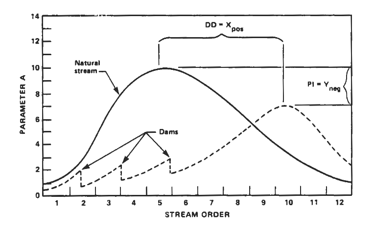
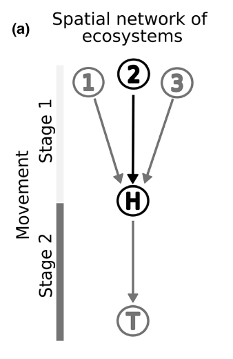

```{r}
library(renv)
renv::load()
library(targets)
library(here)
tar_config_set(
  store = here::here("_targets")
)
```

# Introduction

## The River Continuum Concept

:::: {.columns}

::: {.column width=40%}
{fig-align="center"}
@Vannote-etal-1980
:::

::: {.column width=60%}
- In *natural* stream, communities form a continuum
- Species turnover $\rightarrow$ function replacement $\rightarrow$ 
efficient use of energy input
- Downstream community captalize on upstream community outputs
- Provide a baseline expectation
- Limitations:
  - Focus on the main stream: ignore the stream network
  - Dispersal ability of organisms are disregarded
:::

::::

## The Serial Discontinuity Concept

:::: {.columns}

::: {.column width=50%}
- @Ward-Stanford-1983 assess the impact of discontinuities (e.g. dams) on
downstream biotic and abiotic conditions
- Discontinuity impact with its position along the river continuum
- Cumulative effects of impoundment?
- Limitation: we rarely have access to natural stream at the scale of the bassin
:::

::: {.column width=50%}
{fig-align="center"}
@Ward-Stanford-1983
:::

::::


## The impacts of dams on riverine ecosystems

:::: {.columns}

::: {.column width="60%"}
{fig-align="center"}
@He-etal-2024
:::

::: {.column width="40%"}
- Decrease and richness abundance of migratory species [@Chan-etal-2025b]
- Lotic to lentic environment [@He-etal-2024]
- Retention of sediments and nutrients
- Nutrient availability drive community richness [@Ho-Altermatt-Carraro-2023]
- Increasing connectivity promote trophic length through prey availability
[@LeCraw-Kratina-Srivastava-2014]
:::

::::

## How these impacts spread throughout the river-sea continuum
### A meta-ecosystem perspective

:::: {.columns}

::: {.column width="60%"}
- Because ecosystem are connected in space the distrubance can spread
- Adressed by @McCann-etal-2021c with a small meta-ecosystem model
- Nutrients driven instability
- Finds that terminal node is the most sensitive
- In our case, upstream of the dam
:::

::: {.column width="40%"}
{width=70%}

@McCann-etal-2021c
:::

::::

## How multiple stressors interact 

- Stressors can interact with one another such that they can multiply or cancel
their individual impacts [@Jackson-Pawar-Woodward-2021a]
- The interaction can be synergistic or antagonistic [@Orr-etal-2024a]
- Temperature $\times$ nutrients
  - Expected in theory to be antagonistic [@Binzer-etal-2012]
  - But not supported by empirical data [@Bonnaffé-etal-2024b]
- Dam $\times$ nutrients
  - Decrease in connectivity which favor accumulation and so eutrophication
  [@Maavara-etal-2020]
- Dam $\times$ dam
  - Dam have cumulative impact on migratory species [@Dean-etal-2023b]

## In brief

- Dams have been reported to have an impact on riverine ecosystem
- But studies are mostly *local* and focused on *species richness*
- Furthermore the interaction of dams with other stressors has not been clearly
assessed
- Lastly, dam impact could spread to the sea but this propagation has not been
investigated
  - Separation between freshwater and marine ecology 
  - Different survey and dataset
  - Different interests, terminology, etc.
- We aim to link these fields, to answer the following question...

# How dams reshape food web along the river-sea continuum by disrupting spatial fluxes?

## What we have

:::: {.columns}

::: {.column width=60%}
```{r}
tar_read(plot_station)
```
:::

::: {.column width=40%}
- River and coast/estuary data (respectively provided by Alain and Anik)
- Long time series (e.g. Nurse survey started in 1980)
  - Not always continuous (gaps)
  - Different protocoles
- Species abundances
- Individual fish size (sometimes missing)
:::

::::

## What we plan to add

For each local community:

- Distance to the sea/source
- Dams location
- Salinity
- Temperature
- Nutrient concentration
- ... (any suggestion?)

::: {.callout-caution}
Data should be available at each site (or can be infered) **along the river-sea
continuum**.
:::

## Measuring the impact of dams

- Distance to the closest dam
- Height/reservoir volume of the closest dam
- Accumulated heights of upstream/downstream dams [@Dean-etal-2023b]
- **At what scale dam impacts operate?**
  - Use the literature, but difficult because of varied impacts on species
  - Make the statistical model infer the scale
  - $\text{Dam}_\text{down}(L) = \sum_{i \in \text{dam}} h_i e^{-\frac{d_i}{L}}$
  - $L$ define the scale at which dam operates
  - Try different values and compare WAIC (that is, model performance)

# Food web reconstruction

## How we reconstruct food webs
### The base

```{r}
DiagrammeR::grViz(readLines(here("figures", "foodweb.dot")))
```

## How we reconstruct food webs
### Diet and piscivory

- Extract fish diet with **fishbase**
- Diet changes with ontogeny (juvenile vs adults)
- Piscivorous interaction infered with predation window (e.g. 5-45% body size)
- Build a global metaweb with all possible interactions
- Infer local food web by subsampling
- Quantify structure with **connectance** and **trophic length** 
(a metric weighted by biomass?)

::: {.callout-note}
Methods of @Bonnaffé-etal-2021.
:::

# Statistical analysis

## What we want
### How dams reshape food web along the river-sea continuum by disrupting spatial fluxes?

- Quantify the impact of dams on food web structure
- In space and time
- Along the river-sea continuum
- Quantify interaction of dam with other stressors
- Bonus (liste au Père Noël):
  - Use spatial correlation to assess flux between ecosystem (meta-ecosystem view)
  - Predict the impact of dam removal (may be possible with bayesian model)
  - Sélune project: tracking the impact of dam removal in Britany

## The statistical model
### Causal graph (DAG)

```{r}
tar_read(plot_dag)
```

## The statistical model
### Equation

$$
\begin{align}
\text{TL}_i &= \text{Normal}(\mu_i, \sigma_i) \\
\text{logit} (\mu_i) &= \beta_0 + \beta_1 D_i + \beta_2 \text{Dam} + ... ~ \text{[fixed effects]} \\
&+ \text{interactions} \\
&+ \text{random effects}
\end{align}
$$

- Account for survey random effects
- Account for spatial and temporal auto-correlation
- *Use a spatiotemporal model (`R-INLA`)*
- Possible limitations
  - Can we distengle survey bias from environment effect?
  - Until where the concept of continuum holds?
  - Do we have high variability in dams density between hydrographic bassin?

## Roadmap

- Build food webs in the coast/estuary
- Update food webs in rivers
- Collect and infer if necessary environmental data
- First perform "coarse-grained" statistical analysis
  - At the bassin scale: Number of dam vs. Trends [TL vs Distance to the source]
  - PCA to assess the main environmental drivers of food web structure
- Next, refine statistical analysis (`R-INLA`)...

# Thank you! Questions ?

## References
