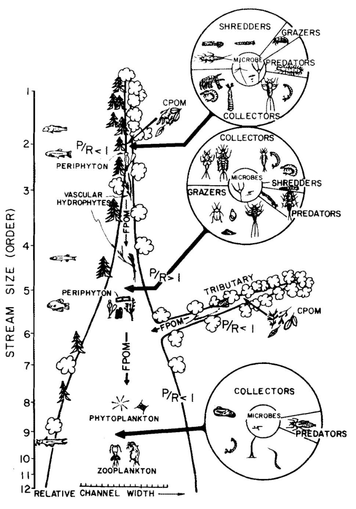
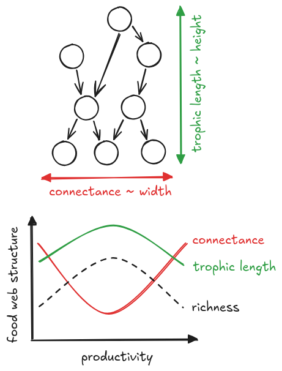
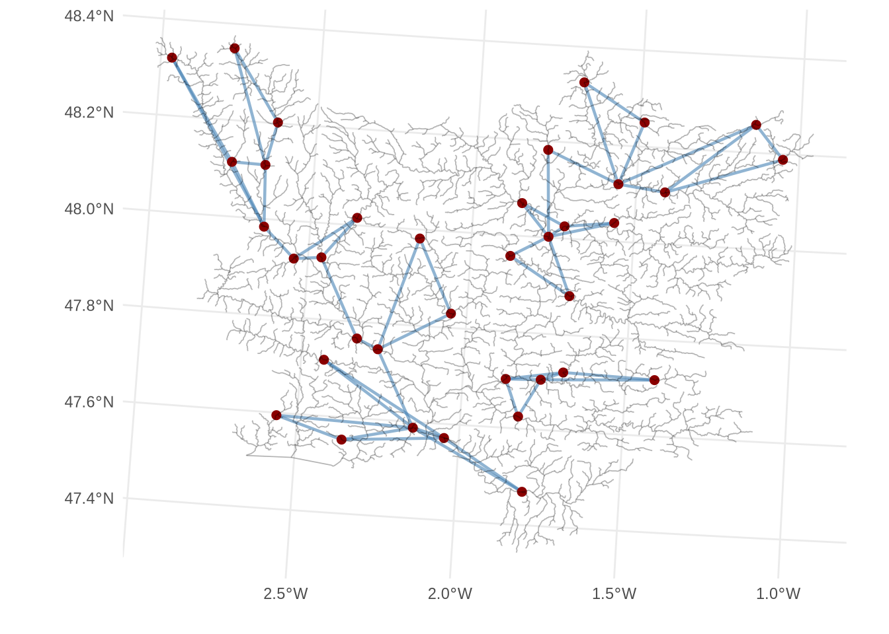
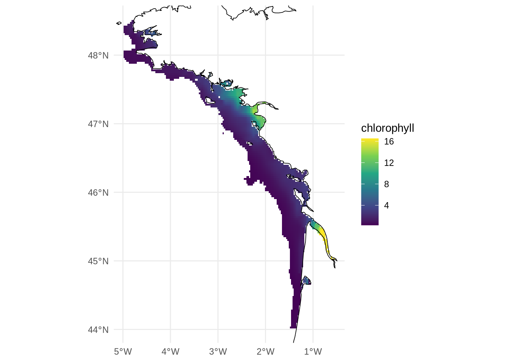
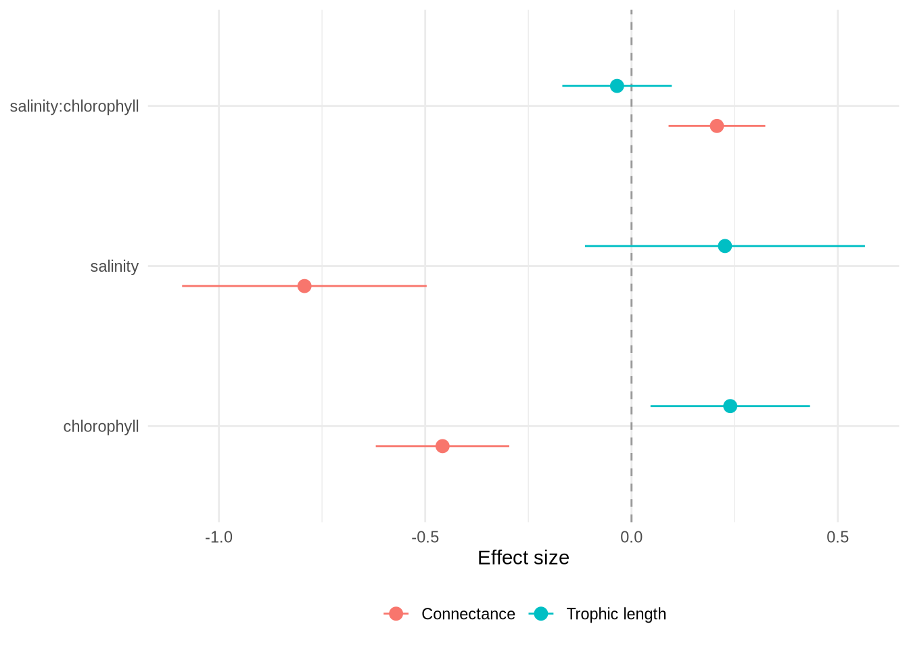
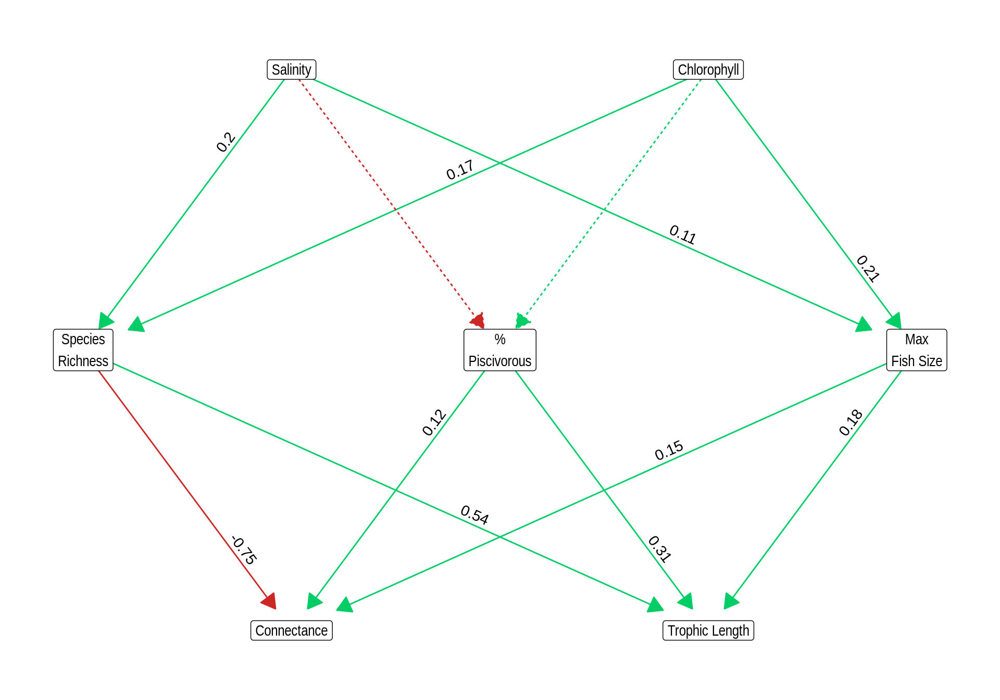
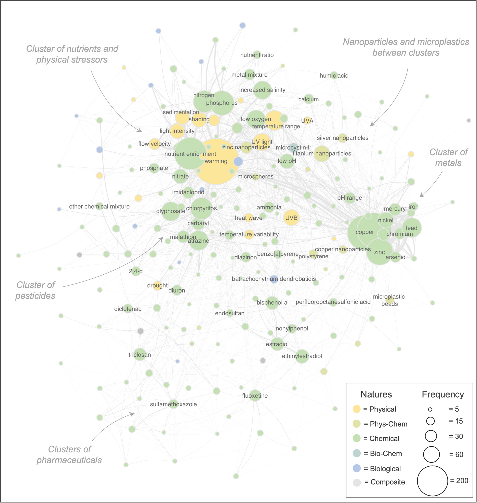

```{r}
library(renv)
renv::load()
library(targets)
library(here)
tar_config_set(
  store = here::here("_targets")
)
```

# Different but connected ecosystems {background-color="#40666e"}

## Different but connected ecosystems

:::: {.columns}

::: {.column width=50%}

Garonne estuary -- © CNES 2020
:::

::: {.column width=50%}
Rivers, estuaries and seas are different ecosystems.

Yet they are connected.

How can we understand disturbances that propagate [**across**]{.alert} these systems?
:::

::::

## An integrative approach is needed

:::: {.columns}

::: {.column width=50%}
{height=4in}
*NASA Earth Observatory*

Algae bloom can be caused by upstream nutrient excess.
:::

::: {.column width=50%}
{height=4in}
*He et al. (2024)*

Dam impact migratory species which in turn impact entire ecosystem.
:::

::::

## An integrative approach is difficult

Different fields.

Different concepts.

Different interests.

**Different datasets.**

SCREENSHOT OF A SALTY DIVIDE ARTICLE


## Different but connected ecosystems

Rivers, estuaries and seas are different ecosystems.
Yet they are connected.
Although, often studied separately.


Garonne estuary -- © CNES 2020


## The River Continuum Concept

:::: {.columns}

::: {.column width=60%}
- Species turnover $\rightarrow$ function replacement $\rightarrow$ 
efficient use of energy input
- Focus on the main stream, ignore the dendritic river network
  - Food Pulse and River Wave concepts [@Junk-Bayley-Sparks-1989;
  @Humphries-Keckeis-Finlayson-2014]
- Ignore disturbance impacts (dams, nutrients overloads)
  - Serial Discontinuity Concept [@Ward-Stanford-1983]
  - Meta-ecosystem theory [@Gounand-etal-2018b]
- Stops at the estuary
- **Pattern of food web structure is largely unknown**
:::

::: {.column width=40%}
{fig-align="center"}
@Vannote-etal-1980
:::

::::

# How disrupted spatial fluxes reshape food web structure along the river–sea continuum

# Case study: How primary productivity shape food web structure along the estuary-sea continuum

## Expectation regarding food web structure responses

:::: {.columns}

::: {.column width=40%}

*Expected trends of food web structure with productivity*
:::

::: {.column width=60%}
- Two main *dimensions* of food webs
- Widely used metrics in the literature
- Expectation of their response to environment and stressors
  - Unimodal relationship between trophic length and primary productivity
  - ~ reversed relationship for connectance
- We can already identify species richness as a mediator variable
:::

::::

## Standing questions and statistical challenges
### How to ...

:::: {.columns}

::: {.column width=60%}
- ... efficiently model such a large dataset
  - R-INLA sounds promising
- ... handle temporal autocorrelation
  - Autoregressif process (AR1)
- ... handle spatial autocorrelation
  - BYM -- random effect where neighbours share information via
  adjacency graph
- ... integrate survey data with different protocoles
  - Include in the model as a categorical variable
  - Can it be disentangled from the environment?
:::

::: {.column width=40%}

*Example of autocorrelation graph in La Vilaine
Nodes are connected respective to **hydrographic** distances*
:::

::::


# Methods

## Where we start from

:::: {.columns}

::: {.column width=50%}

*Map of the sampling points (fishing operation) for the coastal, estuarine and
riverine data.*
:::

::: {.column width=50%}
- *River survey -- Onema*
  - Excluded for the case study
  - Previously processed by Alain Danet
- **Estuary and coast surveys -- Pomet & Nurse**
  - Current focus
- Long time series, e.g. Nurse survey started in 1980
  - Not continuous, there are some gaps
  - Different protocoles: electrofishing vs trawling
- Species abundances and individual fish size
:::

::::

## From this we reconstruct food web

:::: {.columns}

::: {.column width=50%}
- Metaweb approach inspired by [@Bonnaffé-etal-2021]
- Extract fish diet with `rfishbase`
- Diet changes with ontogeny
  - Distinguish between juveniles and adults
  - Not only species composition but also size distribution affect
    food web structure
- Piscivorous interaction infered with predation window
  - Big fish eat little fish
  - 3-45% body size window
- From the metaweb, we we infer local food web by subsampling
:::

::: {.column width=50%}

*Sketch of the steps to build the metaweb*
:::

::::

## Environmental variables and our first model

:::: {.columns}

::: {.column width=50%}


*Salinity levels in 2023*
:::

::: {.column width=50%}

*Chlorophyll levels in 2023*
:::


**Linear Model**
$$ \text{structure} \sim \text{salinity} + \text{chlorophyll} +
\text{salinity} \times \text{chlorophyll} + \text{year}_i + \text{zone}_i$$

::::

# Results

## How salinity and productivity shape food web structure


:::: {.columns}

::: {.column width=60%}

:::

::: {.column width=40%}
- According to expectations
  - Negative effect of productivity on connectance
  - Opposite trends for trophic length
- Negative effect of salinity on connectance
  - Coastal communities richer than estuary ones
:::

- Is the effect driven by richness only? Diet, fish size.
- How to quantify indirect pathways? SEM (appendix), joint models.
- How to assess model validity regarding spatiotemporal autocorrelations?

::::

# Thank you! Questions?

# Appendix

## Decomposing environmental effects with a SEM



## Stressors and how they interact

:::: {.columns}

::: {.column width=50%}

@Orr-etal-2024a
:::

::: {.column width=50%}
- We focus on stressors that impact connexion between ecosystems
  - Dams, nutrient overloads
  - A local effect that can ripple throughout the continuum
- And stressors that can interact with those 
  - Temperature $\times$ nutrients
  - Expected in theory to be antagonistic [@Binzer-etal-2012]
  - But not supported by empirical data [@Bonnaffé-etal-2024b]
:::

::::

## References

