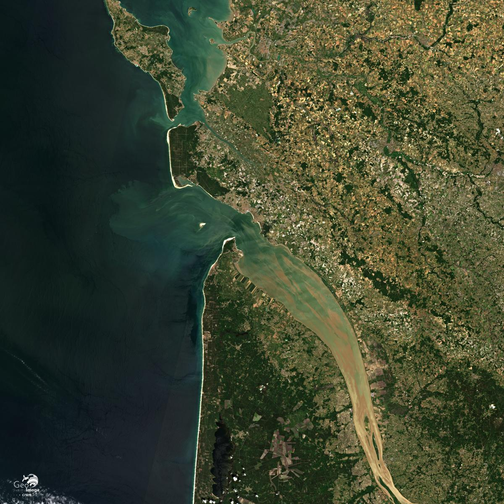
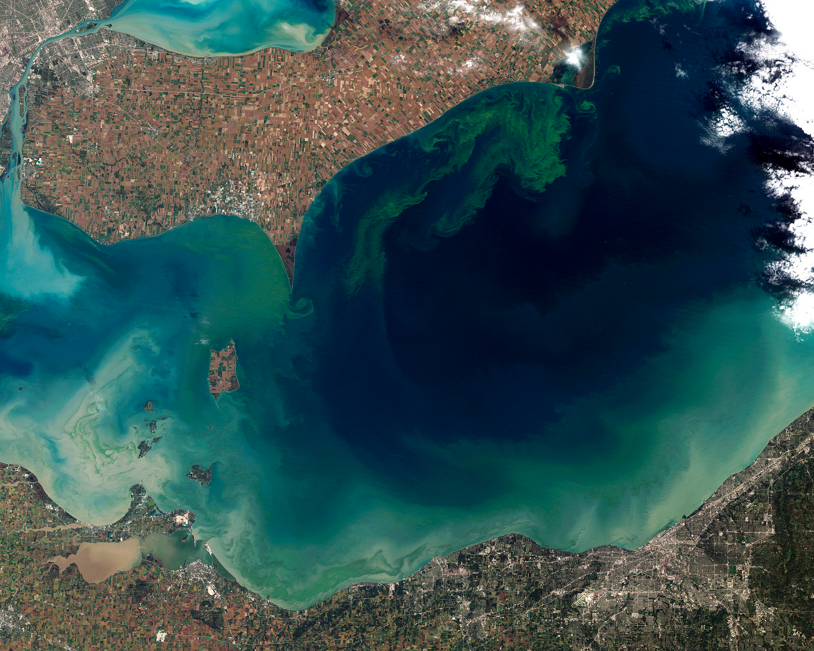
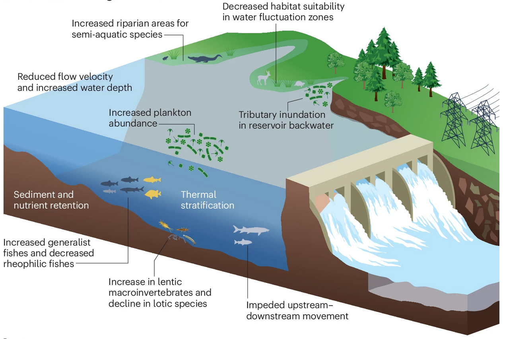
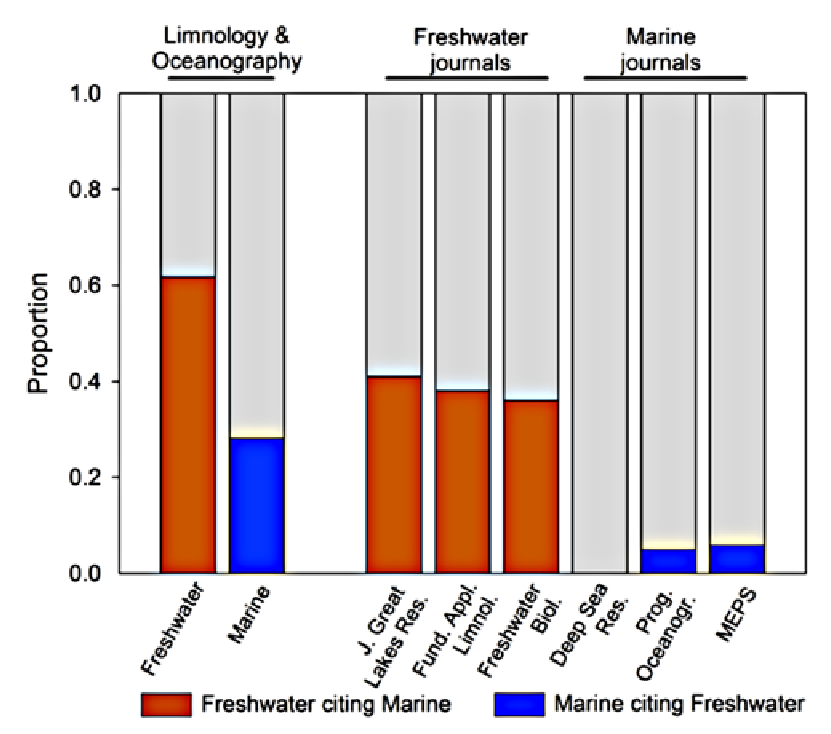
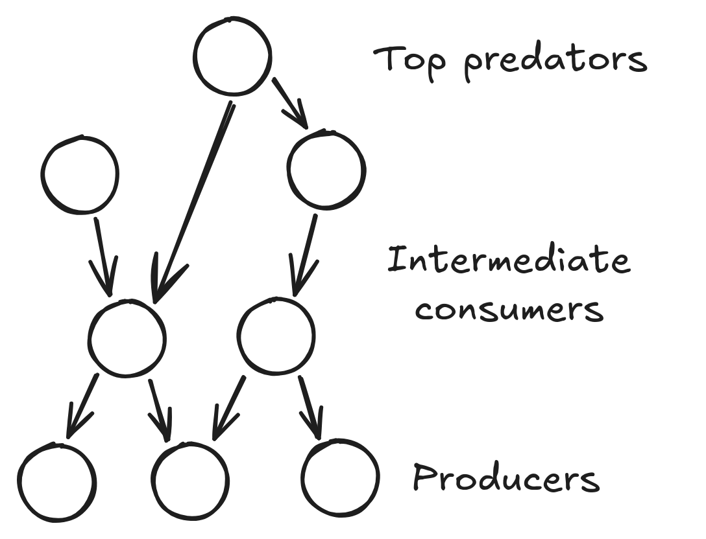
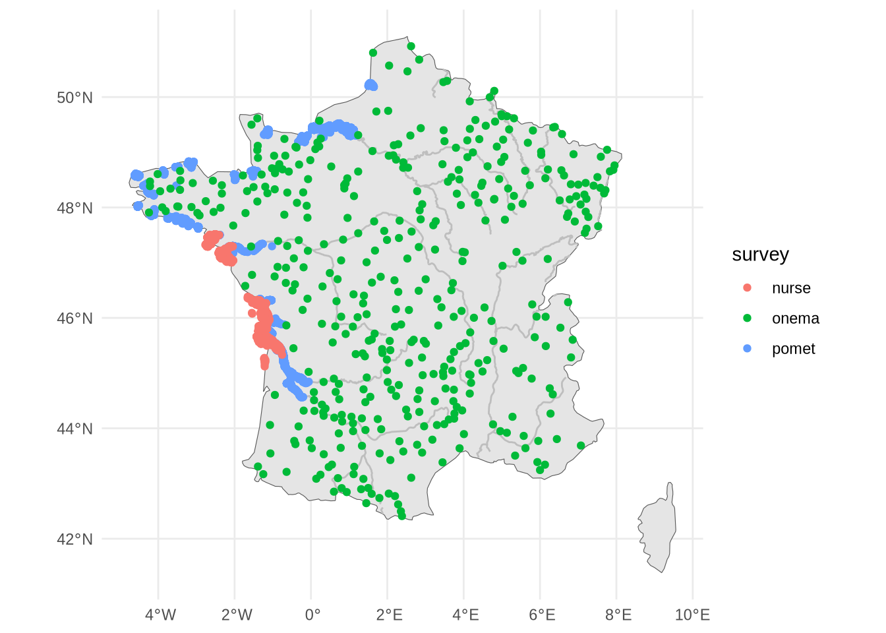
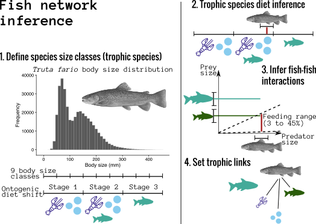
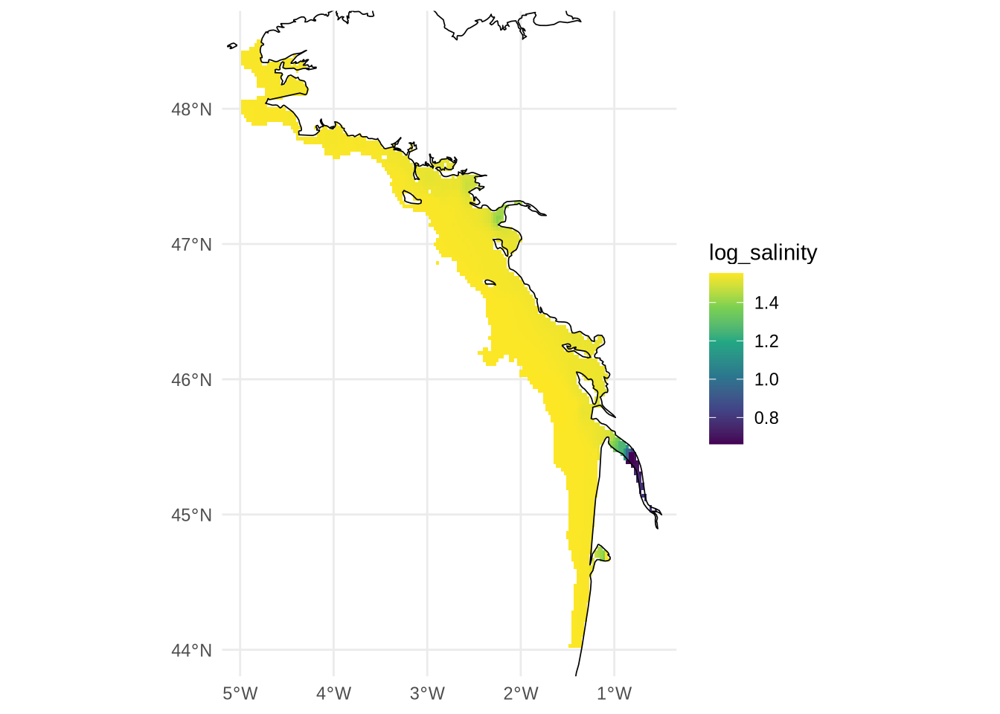

# Different but connected ecosystems {background-color="#40666e"}

## Different but connected ecosystems

:::: {.columns}

::: {.column width=50%}

Garonne estuary -- © CNES 2020
:::

::: {.column width=50%}

Rivers, estuaries and seas are

- different
  - salinity, turbidity, flow
- but connected
  - flux of nutrients, species migration
- then how disturbances propagate **across these ecosystems**?

:::

::::

## An integrative approach is needed

:::: {.columns}

::: {.column width=50%}
::: {.fragment .fade-in}
{height=4in}
*NASA Earth Observatory*

**Algae bloom** can be caused by upstream nutrient excess.
:::
:::

::: {.column width=50%}
::: {.fragment .fade-in}
{height=4in}
*He et al. (2024)*

**Dams** impact migratory species which impact entire ecosystem.
:::
:::

::::

## An integrative approach is difficult

:::: {.columns}

::: {.column width=40%}

*Kavanaugh et al. (2013)*
:::

::: {.column width=60%}
An integrative approach means dealing with different

- fields
  - Marine vs freshwater ecology
- Different concepts
  - e.g. River Continuum Concept
- **Different datasets**
:::

::::

# How nutrient excess and dams impact food web structure **along the river-sea continuum**? {background-color="#40666e"}

## Why food web structure

:::: {.columns}

::: {.column width=40%}

:::

::: {.column width=60%}
Food web structure

- is a measure of **ecosystem complexity**
- captures different aspects than species richness
- tells how the **ecosystem functions**
- captures **vertical complexity** and flux of biomass or energy

:::

::::

## The datasets we aim to combine

:::: {.columns}

::: {.column width=50%}
- 2 marine surveys
  - Nurse, IFREMER, Bay of Biscay (1980 - 2023)
  - Pomet, IFREMER (DCE), Gironde estuary (2005 - 2019)
- 1 freshwater survey
  - Onema, DCE, Across France (every year)
- **Key differences**
  - Eletrofishing vs trawley
  - Fish length measurement
:::

::: {.column width=50%}
::: {.fragment .fade-out}

*Map of the sampling points (fishing operation) for the coastal, estuarine and
riverine data.*
:::
:::

::::

## The datasets we aim to combine

:::: {.columns}

::: {.column width=50%}
::: {.nonincremental}
- 2 marine surveys
  - Nurse, IFREMER, Bay of Biscay (1980 - 2023)
  - Pomet, IFREMER (DCE), Gironde estuary (2005 - 2019)
- 1 freshwater survey
  - Onema, DCE, Across France (every year)
- **Key differences**
  - Eletrofishing vs trawley
  - Fish length measurement
:::
:::

::: {.column width=50%}

| Species | Length | Operation ID | 
|---------|------|-------|
| Abramis brama  | 12   |  1 |
| Salmo trutta  | 15   |  1 |
| ...     | ...  |   ... |

: The data we work with

::: {.fragment}
[Different selectivity]{.alert}

[Inconsistencies between datasets]{.alert}

[Get info on many species]{.alert}
:::
:::

::::

## From this we reconstruct food web

:::: {.columns}

::: {.column width=50%}
- We use the metaweb framework
- Extract fish diet with `rfishbase`
- Diet changes with ontogeny
  - Juveniles $\neq$ adults
- Piscivorous interaction infered with predation window
  - Big fish eat little fish
- From the metaweb, we we infer local food web by subsampling

::: {.fragment}
[Comparison of different ecosytems]{.alert}
:::
:::

::: {.column width=50%}

*Sketch of the steps to build the metaweb*
:::

::::

## Relate food web to environmental variables

:::: {.columns}

::: {.column width=50%}

*Salinity levels in 2023*
:::

::: {.column width=50%}
Even if the datasets (e.g. abundance) are consistent

- Environmental variable can
be **inconsistent**
- Not **available** for every ecosystem
- Measured in different ways
:::

::::

## Conclusions

- Combining dataset is useful
  - Can answer new and important questions
- Combining datasets is difficult
  - Inconsistencies between the datasets themselves (e.g. fishing surveys)
  - Inconsistence between "side" datasets (e.g. environmental drivers)
  - How to compare different ecosystems?
  - Requires different expertise
- [Call for **collaborations** and the development of **shared tools**]{.alert}

# Thank you! Questions? {background-color="#40666e"}
