## A connected but siloed continuum

:::: {.columns}

::: {.column width="50%"}
- Rivers, estuaries and seas are **connected**
  - flux of nutrients, migration of species
- Yet they are often studied **in isolation**
  - freshwater vs marine ecology, separate surveys, ...
:::

::: {.column width="50%"}

:::

::: {.credit}
@Kavanaugh-etal-2013; Figure from CNES (2020)
:::

::::

## A connected but siloed continuum

:::: {.columns}

::: {.column width="50%"}
- Rivers, estuaries and seas are **connected**
  - flux of nutrients, migration of species
- Yet they are often studied **in isolation**
  - freshwater vs marine ecology, separate surveys, ...
- Inconsistency between
  - the ecological continuum
  - siloed research fields
:::

::: {.column width="50%"}
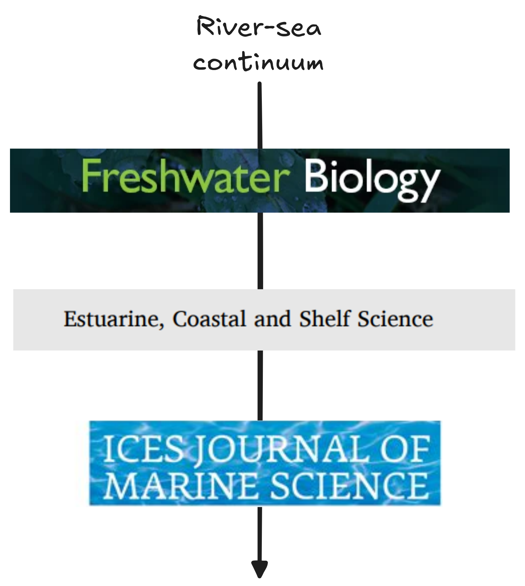
:::

::::

## Disturbances propagate at a distance

- Experiment of @Tadiri-etal-2024
  - Daphnia (herbivore) eating algae & connected mesocosms
  - Disturbance = input of nutrients
  - The disturbance is amplified from the input to the terminal node

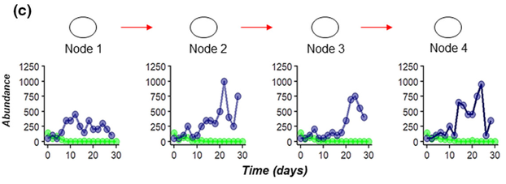{fig-align="center" height=200}

**Disturbances can propagate along the river-sea continuum**

::: {.credit}
Figure from @Tadiri-etal-2024;
@Carrara-etal-2012;
@McCann-etal-2021c
:::

## Taking a meta-ecosystem perspective

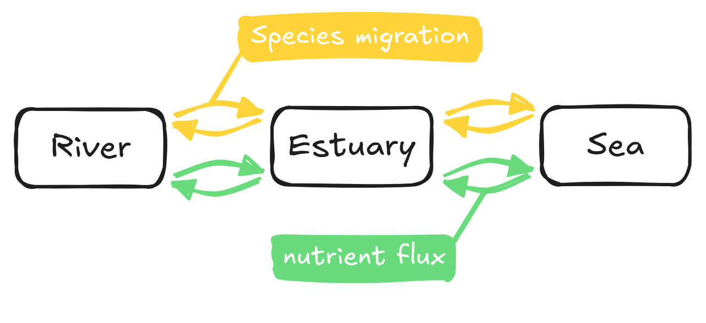{fig-align="center" width="60%"}

- **Dams** block species migration and nutrient fluxes
- **Nutrient runoffs** increase nutrient fluxes
- These stressors alter **how ecosystems are connected**

::: {.credit}
@Loreau-Mouquet-Holt-2003a; @Polis-Anderson-Holt-1997; @Gounand-etal-2014
@He-etal-2024
:::

## Capturing changes with food webs
### At a local scale

:::: {.columns}

::: {.column width="60%"}
- Who eats whom: energy and matter fluxes
- Understanding the paradox of enrichment
  - Enrichment leads to consumer-resource cycles
  - Make sense through a food web lens
- We understand this **locally**

And, at a global scale?
:::

::: {.column width="40%"}
{fig-align="center" fig-width="70%"}
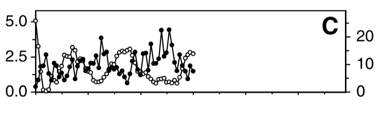
:::

::::

::: {.credit}
Bottom right figure from @Fussmann-etal-2000;
@Gounand-etal-2014;
@Rosenzweig-1971
:::

## Capturing changes with food webs
### At a global scale

Very few studies

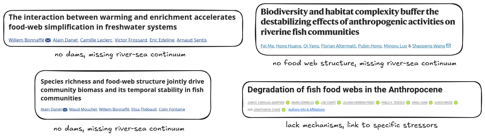{fig-align="center" width="100%"}

::: {.credit}
@Bonnaffé-etal-2024; 
@Carvajal-Quintero-etal-2026; 
@Ma-etal-2026b;
@Danet-etal-2021
:::

# How do dams and nutrient enrichment alter food web structure along the river-sea continuum? {background-color="#275662"}

## Hypotheses

- **H1**: Pressures act in part through direct and richness-mediated effects
- **H2**: Nutrients have a unimodal effect on food web structure
- **H3**: Dam effect decays with distance to river mouth
  - First dams block piscivorous migratory species moving upstream

{fig-align="center" width="70%"}

## Hypotheses

- **H1**: Pressures act in part through direct and richness-mediated effects
- **H2**: Nutrients have a unimodal effect on food web structure
- **H3**: Dam effect decays with distance to river mouth
  - First dams block piscivorous migratory species moving upstream

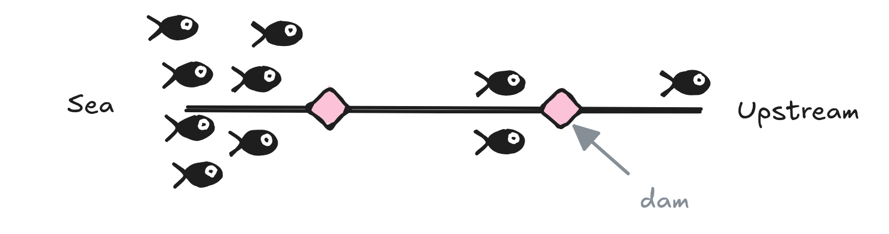

# Methods

## Fish survey data

{fig-align="center" width="60%"}

- 3 surveys harmonized
  - ASPE (river, OFB), Pomet (estuary, INRAE), Nurse (sea, IFREMER)
- Species names, units and fish lengths standardized
- Missing **lengths** imputed from observed length distributions

## Reconstructing food webs

:::: {.columns}

::: {.column width="50%"}
- Diet table for 158 species
  1. `rfishbase` [@Boettiger-Lang-Wainwright-2012]
  2. validation with literature
- Diet changes with ontogeny
  - Juveniles $\neq$ adults
  - Approximated by fish **lengths**
- Piscivorous interaction infered with predation window
  - Big fish eat little fish
:::

::: {.column width="50%"}

::: {.credit}
Steps to reconstruct the metaweb by Alain Danet
:::

:::

::::

## Metaweb

:::: {.columns}

::: {.column width="45%"}
{fig-align="center" height="450"}
:::

::: {.column width="55%"}
- Represents **potential** interactions, not realized ones
- Limitations
  - Binary links: no interaction strength or frequency
  - Piscivory inferred from a body-length heuristic
  - No direct observations
  - Same metaweb assumed across the whole continuum

Subsample metaweb to get local webs.
:::

::::

## Examples of reconstructed food webs

- 3 fishing operations near Gironde estuary
- Cover the river-sea continuum

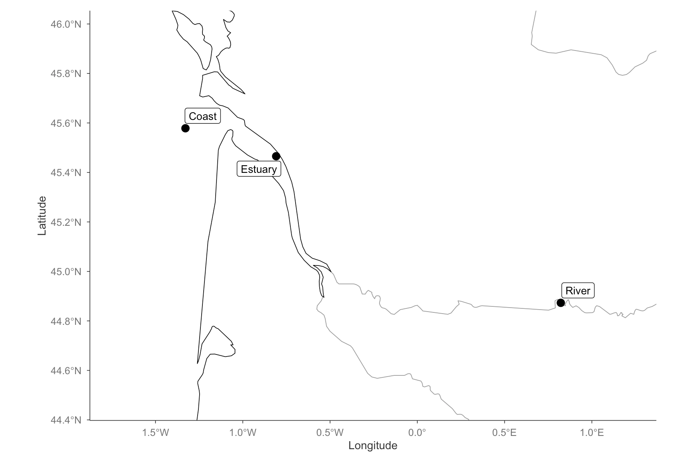{fig-align="center" width="70%"}

## Examples of reconstructed food webs

{fig-align="center" width="60%"}

A few observations

- Simpler community estuary -- stressed environment
- Benthic flatfishs on the coastal food web (*B. luteum*, *S. solea*)
- Riverine fish community is the most complete here -- with large piscivores (*A.
anguilla*, *S. glanis*)

## Quantifying dam indicators

:::: {.columns}

::: {.column width="50%"}
Dam impact is

- Directional -- upstream vs downstream
- Modulated by its height

We used two metrics from the AMOBIO dataset [@Dézerald-etal-2020b] (ROE)

- **Downstream barrier effect**: mean dam height linear downstream
- **Upstream barrier effect**: mean dam height dendritic upstream
:::

::: {.column width="50%"}
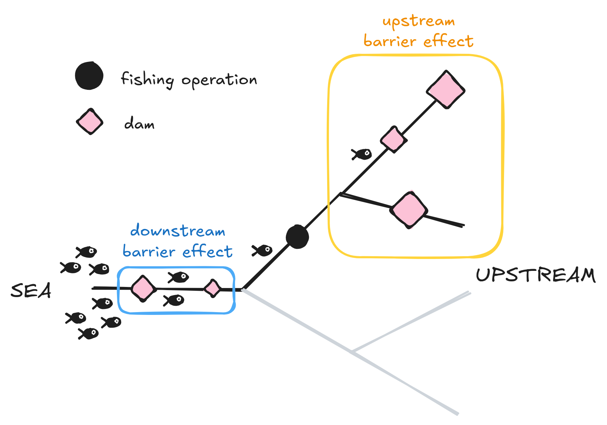
:::

::: {.credit}
@Dézerald-etal-2020b
:::

::::

## Quantifying nutrient indicators

:::: {.columns}

::: {.column width="60%"}
**Nitrate** and **phosphate** concentrations

- In river, we relied on the AMOBIO dataset (Naïades)
  - Nearest neighbor interpolation
- In estuaries and coasts, we used REPHY
  - Interpolated with `INLA`
  - Mesh; random gaussian field; correlation decreasing with distance
:::

::: {.column width="40%"}
{fig-align="center"}
:::

::::

::: {.callout-warning}
Work in progress: nutrient definitions are not yet fully consistent
between AMOBIO and REPHY.
:::

::: {.credit}
@Dézerald-etal-2020b;
@Lindgren-Rue-2015
:::

## Positions along the continuum

:::: {.columns}

::: {.column width="50%"}
### The problem

We want to compute the **distance to river mouth**.

Why euclidian distance doesn't do the job

- fish don't fly
- hydrographic distance matters in rivers
- sea-side, the coastline should be accounted for

:::

::: {.column width="50%"}
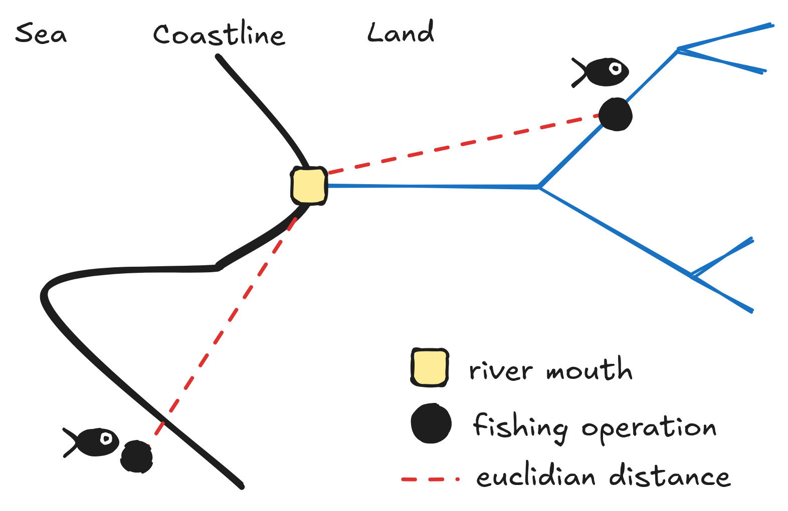
:::

::::

## Positions along the continuum

:::: {.columns}

::: {.column width="40%"}
### The solution

- Distance to river mouth
  operation
  - **River**: shortest path along the hydrographic network
  - **Sea**: shortest path along a coastal mesh (`INLA`) excluding land

:::

::: {.column width="60%"}
{fig-align="center" width="80%"}
:::

::: {.callout-note}
We also added operation elevation and river width, when available.
:::

::::

## Designing statistical models

{fig-align="center" height="150"}

- 3 models:
  - richness (S) -- Gaussian model
  - connectance (C) -- Beta log-link (bounded between 0 and 1)
  - trophic length (TL) -- two step model (ordinal & conditional Gaussian)
- **H1**: species richness included as a covariate for C and TL
- **H2**: quadratic terms for nitrate and phosphate
- **H3**: dam barrier effects interact with distance to mouth

## Designing statistical models

{fig-align="center" height="150"}

- 3 models:
  - richness (S) -- Gaussian model
  - **connectance (C)** -- Beta log-link (bounded between 0 and 1)
  - trophic length (TL) -- two step model (ordinal & conditional Gaussian)
- **H1**: species richness included as a covariate for C and TL
- **H2**: quadratic terms for nitrate and phosphate
- **H3**: dam barrier effects interact with distance to mouth

## Designing statistical models

Model ingredients:

- Linear effects including 
  - species richness ($S_i$) 
  - stressor covariables ($x_i$)
- Random effects controlling for bias

**Connectance** (beta, logit link)
$$
\text{connectance}_i \sim \text{Beta}(\mu_i, \phi)
$$
$$
\begin{aligned}
\text{logit}(\mu_i) &=
  \underbrace{\beta_0}_{\text{intercept}} +
  \underbrace{\beta_S \, \text{S}_i + \mathbf{x}_i^\top \boldsymbol\beta}_{\text{linear effects}}
  + \underbrace{\text{year}_i + \text{watershed}_i + \text{SPDE}_i}_{\text{random effects on intercept}}
\end{aligned}
$$

# Results -- Case study on the river continuum {background-color="#275662"}

## Drivers of food web connectance

:::: {.columns}

::: {.column width="40%"}
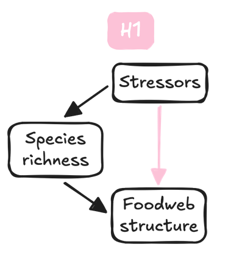{fig-align="right" width="50%"}
:::

::: {.column width="60%"}
{fig-align="left" width="70%"}
:::

::::

- Richness partly mediate stressors impact on structure: H1 validated 
- Habitat variables strongly structure food webs
- Nutrients have opposite direct effects
- Dams have no **average** direct effects

## Effect of nutrients on connectance

:::: {.columns}

::: {.column width="40%"}
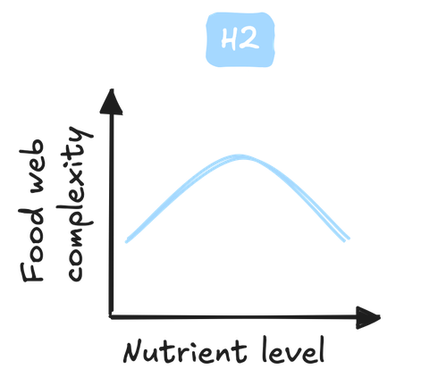{fig-align="right" width="70%"}
:::

::: {.column width="60%"}
{fig-align="left" width="60%"}
:::

::::

- Phosphate is consistent with H2
- Nitrate has the opposite trend than expected
- The opposite pattern could be related to the limiting nutrient

## Dam effects along the continuum

:::: {.columns}

::: {.column width="40%"}
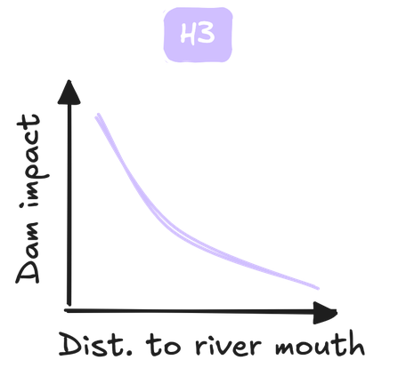{fig-align="right" width="60%"}
:::

::: {.column width="60%"}
{fig-align="left" width="50%"}
:::

::::

- Dam effect vary along the continuum
- Close to river mouth
  - **Downstream dams** leads to **simpler** food webs
  - **Upstream dams** leads to **more complex** food webs
- Consistent with H3, but overall small effects

## In conclusion

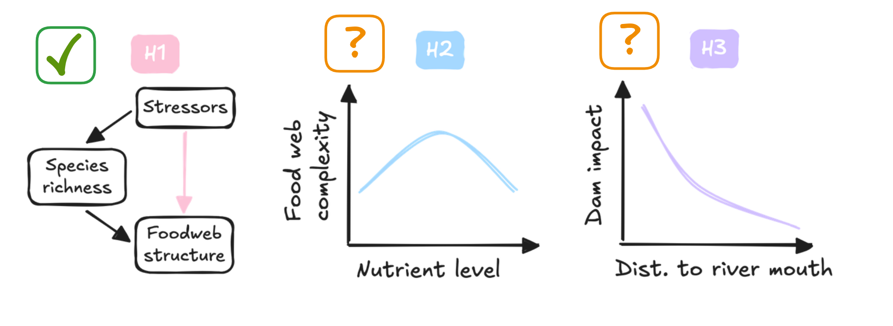{fig-align="center" width="60%"}

1. Stressors have direct and richness-mediated effects
2. Nutrients have opposite unimodal effects
3. Dam barrier effects vary along the river continuum

- Limiting nutrient: model load (N+P) and stochiometric ratio (N:P)
- Dam small effects: filter only for large obstacles?

# Thank you! {background-color="#275662"}

**Thanks to Bastien Bourillon, Olivier Dézérald and Karl Kreutzenberger for
their help with the AMOBIO dataset.**

*References*
