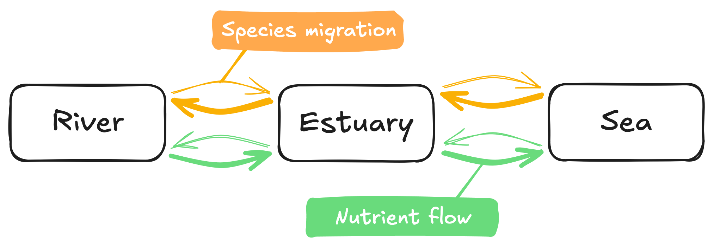
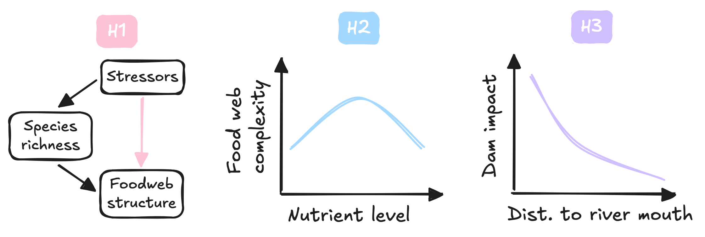
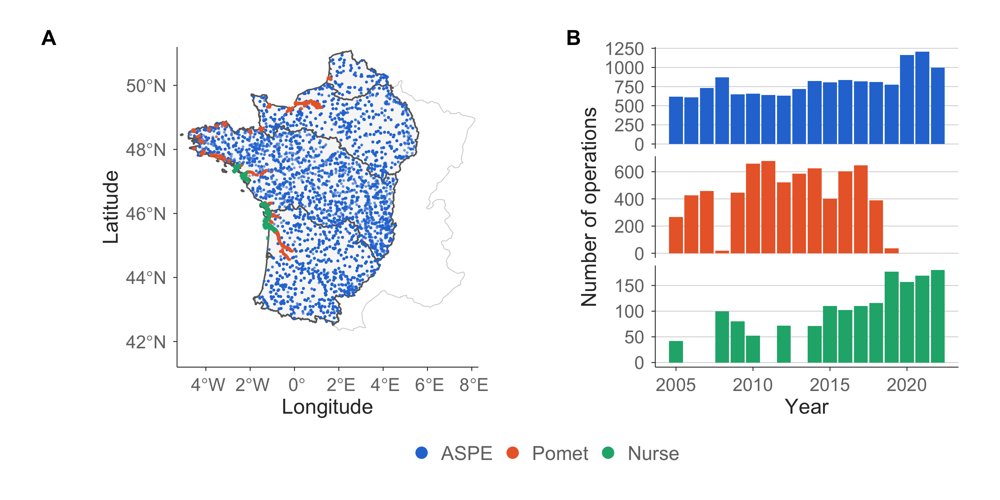
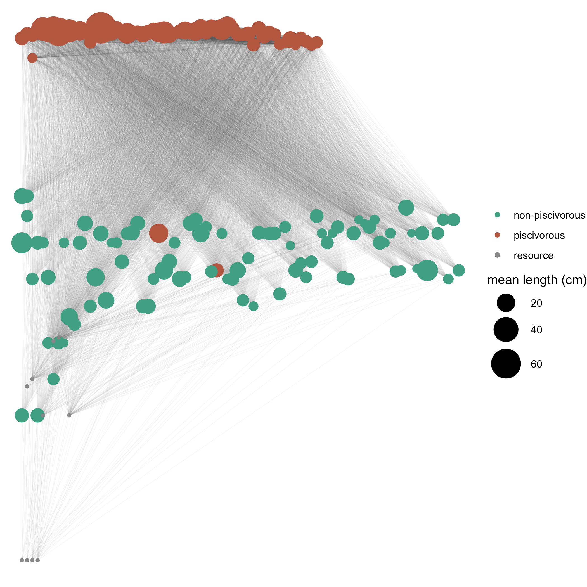
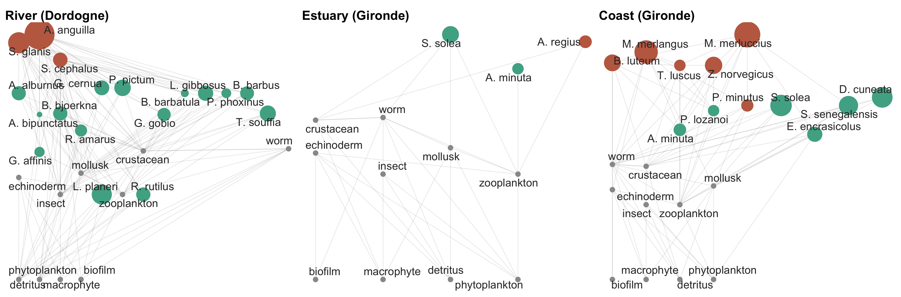
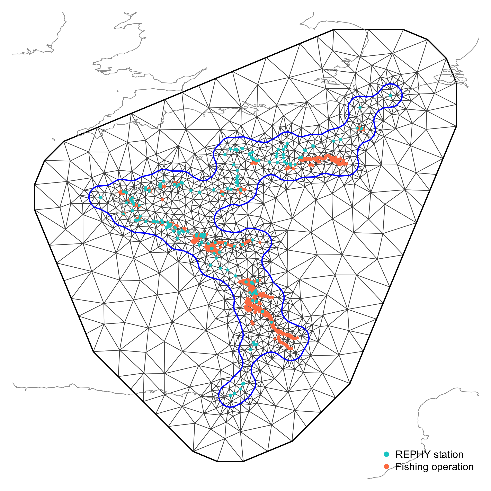
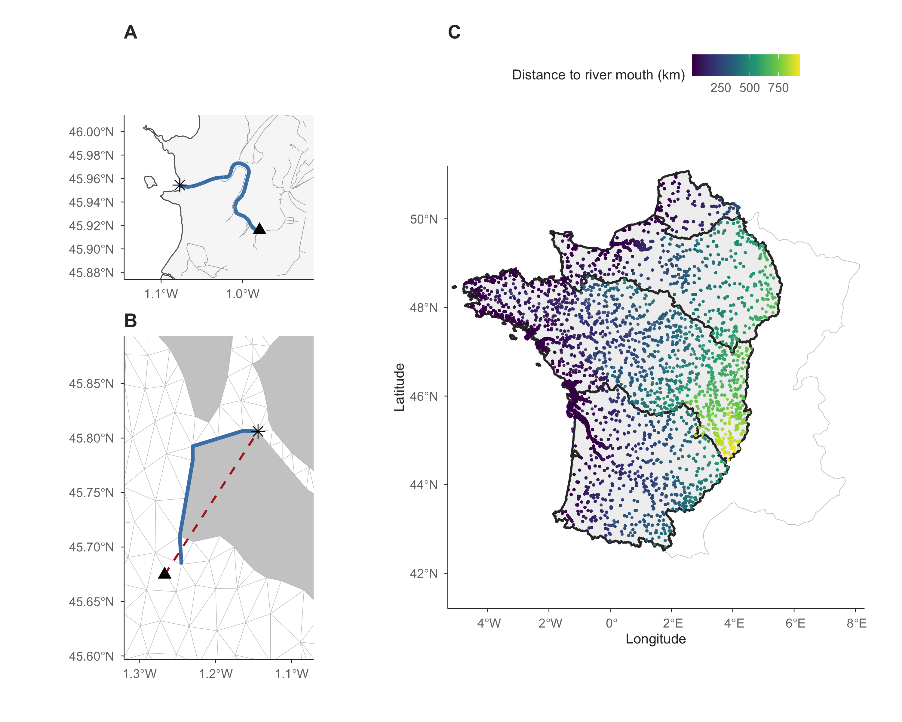
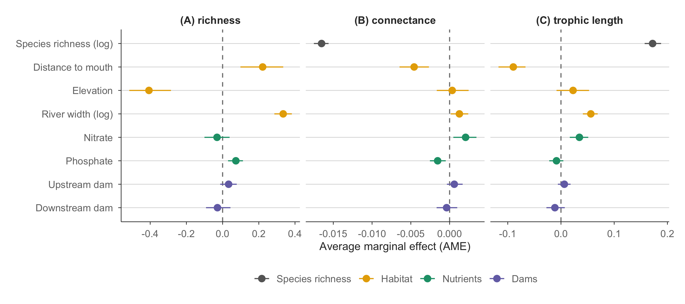
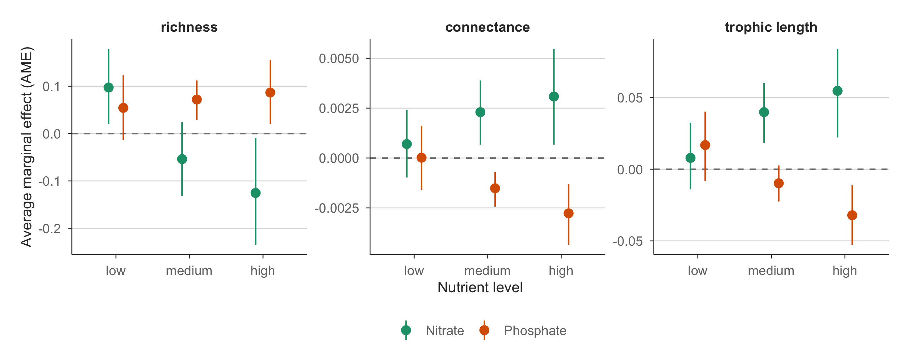
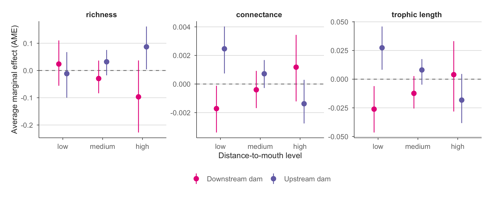

## A connected but siloed continuum

:::: {.columns}

::: {.column width="50%"}
- Rivers, estuaries and seas are **connected**
  - flux of nutrients, migration of species
- Yet they are often studied **in isolation** [@Kavanaugh-etal-2013]
  - freshwater vs marine ecology, separate surveys, separate models
- Cannot seize the impacts of pressures **across** ecosystems
  - Dams, nutrient enrichment
:::

::: {.column width="50%"}

Garonne estuary -- © CNES 2020
:::

::::

## Taking a meta-ecosystem perspective

{fig-align="center" width="70%"}

- Fluxes can be mostly **directional**: nutrients flow from river to the sea
- Contrasting habitat structure: dendritic river network vs. open sea
- Fluxes shape ecosystem: nutrient subsidies boost productivity

*@Loreau-Mouquet-Holt-2003a*

## Stressors alter fluxes and so ecosystems

:::: {.columns}

::: {.column width="50%"}
- **Dams** block migratory species and alter downstream flows [@He-etal-2024]
- Argriculture and industry produce **nutrient runoffs** that enrich rivers, and
downstream systems
- Both pressures impact local communities along the river-sea continuum
  - Quantified by foodweb structure
:::

::: {.column width="50%"}
{width=4in}
{width=4in}
:::

::::

# How do dams and nutrient enrichment alter food web structure along the river-sea continuum? {background-color="#275662"}

## Hypotheses

- **H1**: Pressures act in part through direct and richness-mediated effects
- **H2**: Nutrients have a unimodal effect on food web structure
- **H3**: Downstream, dams simplify food webs downstream, their effects fades
moving upstream

{fig-align="center" width="70%"}

## Methods -- fish survey data

{fig-align="center" width="60%"}

- 3 surveys harmonized
  - ASPE (river, OFB), Pomet (estuary, INRAE), Nurse (sea, IFREMER)
- Species names, units and fish lengths standardized
- Missing sizes imputed per species from observed length distributions

## Methods -- reconstructing food webs

:::: {.columns}

::: {.column width="60%"}
- Diet table for 158 species
  1. `rfishbase` [@Boettiger-Lang-Wainwright-2012]
  2. validation with literature
- Metaweb built from diet table
- Subsample to get local webs
- Measure **connectance** & **trophic length**
:::

::: {.column width="40%"}
{fig-align="center" height="270"}
:::

::::

{fig-align="center" height="220"}

## Methods -- environmental pressures

:::: {.columns}

::: {.column width="60%"}
- **Nutrients**: nitrate and phosphate
  - River: AMOBIO
  - Sea: REPHY, interpolated with `INLA` [@Lindgren-Rue-2015]
- **Dam impact**: mean dam height (AMOBIO)
  - Downstream: linear, single path to the river mouth
  - Upstream: dendritic, whole upstream network (heritage)
:::

::: {.column width="40%"}
{fig-align="center"}
:::

::::

::: {.callout-warning}
Work in progress: nutrient definitions are not yet fully consistent
between AMOBIO and REPHY.
:::

## Methods -- position along the continuum

:::: {.columns}

::: {.column width="40%"}
- Distance to the nearest river mouth, computed for every fishing
  operation
  - **River**: shortest path along the hydrographic network
  - **Sea**: shortest path along a coastal mesh (`INLA`) excluding land

:::

::: {.column width="60%"}
{fig-align="center" width="80%"}
:::

::: {.callout-note}
We also added operation elevation and river width, when available.
:::

::::

## Methods -- statistical models

- Three Bayesian models (`R-INLA`): S, C, TL
- Testing the hypotheses
  - **H1**: species richness included as a covariate for C and TL
  - **H2**: quadratic terms for nitrate and phosphate
  - **H3**: dam barrier effects interact with distance to mouth
- Controlling for bias
  - Year and watershed random effects
  - Spatial autocorrelation: Gaussian random field (SPDE)

::: {.callout-warning}
Spatial autocorrelation uses euclidian and not hydrographic distance, for now.
:::

# Preliminary results -- Case study on the river continuum {background-color="#275662"}

## H1 - Testing richness mediated-effects

{fig-align="center" width="70%"}

- Richness partly mediate stressor impact on structure *(validates H1)*
- Habitat variables strongly structure food webs
- Nutrients have opposite direct effects
- Dams have no **average** direct effects

## H2 - Testing nonlinear nutrient effects

{fig-align="center" width="70%"}

- Nitrate has an unimodal effect on richness *(consistent with H2)*
- At high concentration
  - **Nitrate** increase is associated to **more complex** food webs
  - **Phosphate** increase is associated to **simpler** food webs

## H3 - Dam effects along the continuum

{fig-align="center" width="70%"}

- Dam effect depends on position along the continuum, in particular for food
web structure
- Close to river mouth
  - **Downstream dams** are associated with **simpler** food webs
  - **Upstream dams** are associated with **more complex** food webs

## Perspectives

#### Next steps

- Finish harmonizing environmental data across the continuum
- Extend statistical modeling to the full river–sea continuum

#### Further investigations

- Model spatial autocorrelation as a **Gaussian field on a graph**
  (`MetricGraph`), following hydrographic distance rather than Euclidean
  distance
- Refine dam impact metrics beyond height (e.g. fish passability, using
  ROE / Naiades)
- Make nutrient inference **consistent across river and coastal** data
  (e.g. AMOBIO vs REPHY nitrite/nitrate definitions)

# Thank you! {background-color="#275662"}

**Thanks to Bastien Bourillon, Olivier Dézérald and Karl Kreutzenberger for
their help with the AMOBIO dataset.**

*References*
